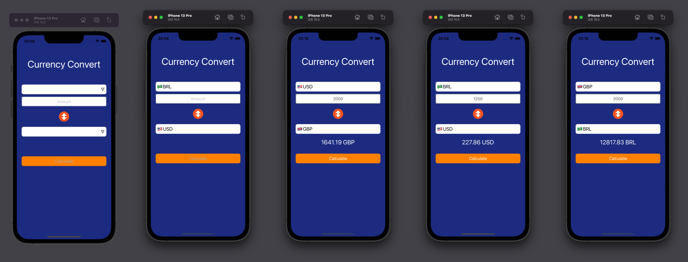

# CurrencyConverter


Full flow login screen with validations

## Used Technologies:
  🔹View Code
  🔹Api Rest
  🔹Cocoapods
  
  ## Configration

After cloning the project, installing the pods:

```
$ cd CurrencyConverter
$ pod install
$ open CurrencyConverter.xcworkspace
```

Run the build in Xcode.

## Screenshots



## Video App Working:

[](https://www.youtube.com/watch?v=I2DDc6rl50I)
